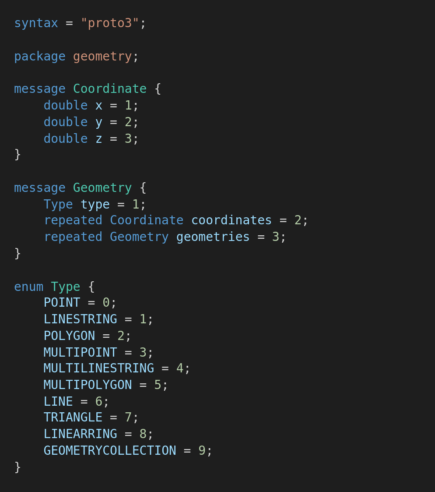
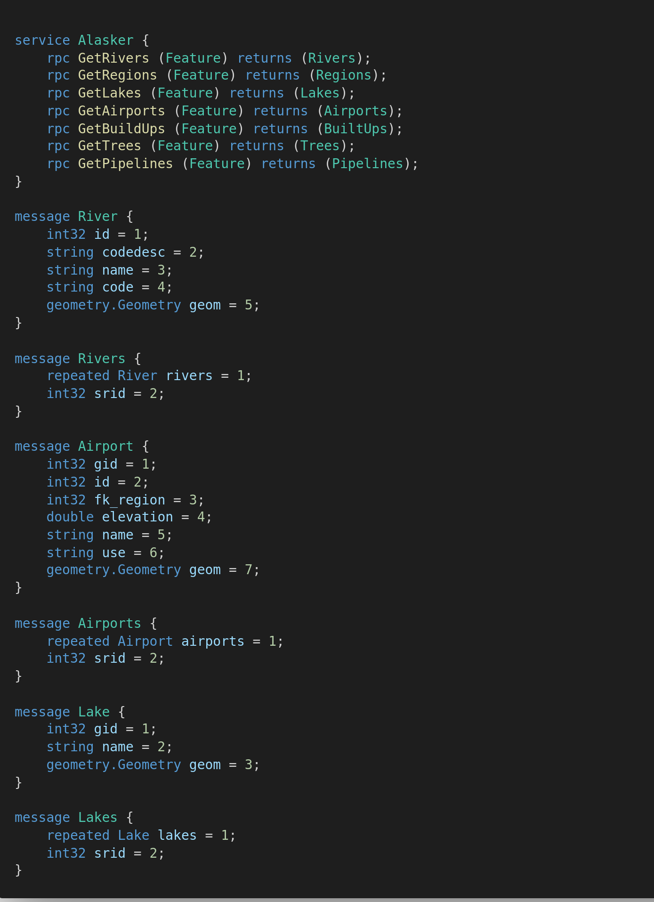

# flutter_python_grpc
An example app to show how to serialize and deserialize GEOS geometries using a common .proto file and plot them in flutter using [pub.dev/packages/flutter_map](flutter_map). 

The original inspiration of this serialization framework was made by [topology-serialization-framework](https://github.com/52North/topology-serialization-framework.git) by [52North](https://github.com/52North) for [Java Topology Suite](https://github.com/locationtech/jts.git)

Since there's a port of [Java Topology Suite](https://github.com/locationtech/jts.git) for Dart, and the defacto of handling geodata in python is shapely, this example shows how to serialize and deserialize geometries transmitted from a python grpc server to a dart client. 

## Requirements
* PostgreSQL database runing with [postgis.net](postgis) installed.
* Flutter
* Python

## Languages Used
* Dart
* Python

## Frameworks Used
### Mobile App
1. [flutter_map](pub.dev/packages/flutter_map) - To renderer maps on app
2. [protobuf](pub.dev/packages/protobuf) - Decode protobuf objects to dart objects from grpc payload
3. [grpc](pub.dev/packages/grpc) - Make calls to python grpc client and handle serialization of common objects like string, num, int, map etc
4. [freezed](pub.dev/packages/freezed) - Union classes to elegantly handle and render states of the app (Loading, Initial,Loaded, Error)
5. [provider](pub.dev/packages/provider) - Handle state management

### Backend(API)
###### The backend architecture is just reading from a postgres(postgis) database using sqlalchemy and geoalchemy2(for geometric/postgis objects) and transmitting the read data to the app via grpc.
Packages used include
1. grpcio==1.32.0
2. grpcio-tools==1.32.0
3. SQLAlchemy==1.3.20
4. GeoAlchemy2==0.8.4
5. protobuf==3.13.0
6. psycopg2-binary==2.8.6
7. Shapely==1.7.1

This example was run reading geometries from [postgis](postgis.net), read using sqlalchemy with support for geometries using geoalchemy2 and serialized to geometries using shapely's `to_shape`. 

I added helpers to serialize the geometries into a grpc format compatible with the proto design below. 

The geometries and metadata defined in the alaska.proto file were then transmitted through [grpc(grpc.net) to flutter and
then deserialized into [dart_jts](pub.dev/packages/dart_jts) geometries which is a port of the Java Topology Suite enabling us to do more spatial operations on the geometries from postgis. 

